# Isaac Sim Replicator
A Tutorial Repository for Isaac Sim Replicator for Synthetic Data Generation.

<div align="center">
  
  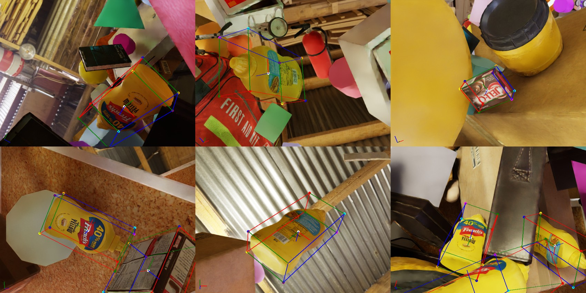
  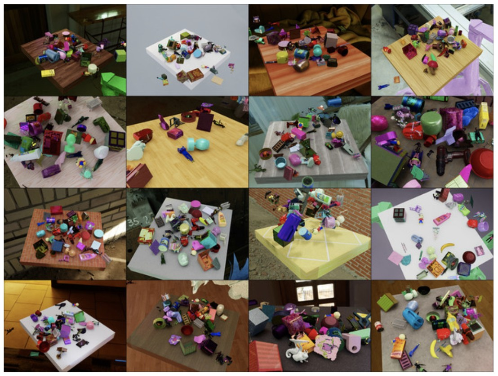
</div>

## License

The code is distributed under the CC BY-NC-SA 4.0 License.
See [LICENSE](LICENSE) for more information.

```python
# Copyright (C) 2025-present by ShalikAI. All rights reserved.
# Licensed under CC BY-NC-SA 4.0 (non-commercial use only).
```

Isaac Sim Replicator provides extensions and workflows for synthetic data generation (SDG) using the `omni.replicator` extension. It supports domain randomizations, sensor simulation, and data collection with annotators and writers. In contrast to `omni.replicator`, where the typical workflow combines randomization and data capture within a generated OmniGraph workflow, the Isaac Sim Replicator workflow focuses on flexibility by independently triggering randomizations and data captures. This makes it better-suited for nondeterministic scenarios such as simulations and robotics tasks.

# Requirements
Isaac Sim 4.5 installation was tested on Ubuntu 22.04, Nvidia RTX 3060, Cuda 12.4, Python 3.10 and ROS2 Humble.

# Installation
- First, go through the tutorial for Isaac Sim Installation from [here](https://github.com/ShalikAI/Isaac-Sim-Tutorial).

## Clone the repo:
First, clone this repo:
```
git clone https://github.com/ShalikAI/Isaac-Sim-Replicator-Tutorial.git
cd Isaac-Sim-Replicator-Tutorial
```
## Start Isaac Sim:
```
cd isaacsim
./isaac-sim.sh
```
On the upper left corner, click on `window` and click on `script editor`. Grab the script editor and release it on the down panel where there are other panels like `console`, `content` and `Isaac Sim Assets`. 

# Data Generation Methods
- [Scene based SDG](https://docs.isaacsim.omniverse.nvidia.com/latest/replicator_tutorials/tutorial_replicator_scene_based_sdg.html)
- [Object based SDG](https://docs.isaacsim.omniverse.nvidia.com/latest/replicator_tutorials/tutorial_replicator_object_based_sdg.html)
- [Environment Based SDG](https://docs.isaacsim.omniverse.nvidia.com/latest/replicator_tutorials/tutorial_replicator_infinigen_sdg.html)
- [Online Generation](https://docs.isaacsim.omniverse.nvidia.com/latest/replicator_tutorials/tutorial_replicator_online_generation.html)
- [Pose Estimation SDG](https://docs.isaacsim.omniverse.nvidia.com/latest/replicator_tutorials/tutorial_replicator_pose_estimation.html)

# Getting Started
This guide outlines a series of example scripts designed to facilitate typical Isaac Sim Replicator workflows. 

The examples include both:
- “asynchronous” usage through the Script Editor and 
- “synchronous” usage through the Standalone Application.

All the standalone scripts are located inside `~/isaacsim/standalone_examples/replicator/`. The directory structure looks like this following:
```
arghya@arghya-Pulse-GL66-12UEK:~/isaacsim/standalone_examples/replicator$ tree -L 2
.
├── amr_navigation.py
├── augmentation
│   ├── annotator_augmentation.py
│   └── writer_augmentation.py
├── infinigen
│   ├── config
│   ├── infinigen_sdg.py
│   └── infinigen_sdg_utils.py
├── object_based_sdg
│   ├── config
│   ├── object_based_sdg.py
│   └── object_based_sdg_utils.py
├── online_generation
│   ├── generate_shapenet.py
│   ├── shapenet_utils.py
│   ├── train_shapenet.py
│   └── usd_convertor.py
├── pose_generation
│   ├── config
│   ├── flying_distractors
│   ├── __init__.py
│   ├── pose_generation.py
│   └── pose_tests
└── scene_based_sdg
    ├── config
    ├── scene_based_sdg.py
    └── scene_based_sdg_utils.py
```


# Functions & Workflows
This section introduces configurations typically used in such workflows.

## Orchestrator Step Funcion

In Replicator, the `orchestrator.step()` function is used to trigger the entire synthetic data generation (SDG) process, including executing randomizations and capturing data. For Isaac Sim workflows, this function is used solely to trigger data capture only, with randomization triggers assigned to custom events and manually activated.

The `step()` function has the following signature:
```
rep.orchestrator.step(rt_subframes: int = -1, pause_timeline: bool = True, delta_time: float = None)
```
Where:

- `rt_subframes`: Specifies the number of subframes to render. A value greater than 0 enables subframe generation, reducing rendering artifacts or allowing materials to load fully.

- `pause_timeline`: Pauses the timeline (if currently playing) after the step if set to `True`.

- `delta_time`: Specifies the time to advance the timeline during a step. Defaults to the timeline’s rate if `None`.

More details on graph-based replicator randomizers can be found in the Randomizer Details, and for custom Isaac Sim or USD API-based randomizations, refer to the Isaac Sim Randomizers Guide.

## Capture on Play Flag
By default, Replicator captures data every frame during playback. For Isaac Sim workflows, data capture is configured to occur at user-defined frames using the `step()` function. To achieve this, the capture-on-play flag is disabled:
```bash
import omni.replicator.core as rep
rep.orchestrator.set_capture_on_play(False)
# OR
import carb.settings
carb.settings.get_settings().set("/omni/replicator/captureOnPlay", False)
```
## RT Subframes Parameter
In scenarios where reducing temporal rendering artifacts is needed, such as ghosting caused by quickly moving or teleporting assets, or under weak lighting conditions, RTSubframes can be used to render the same frame multiple times. This pauses the simulation and renders additional subframes, improving rendering quality.

The rt_subframes parameter is typically set during the capture request in the `step()` function but can also be configured globally:
```bash
# Set the rt_subframes parameter for a specific capture step
rep.orchestrator.step(rt_subframes=4)

# Set the rt_subframes parameter globally
import carb.settings
carb.settings.get_settings().set("/omni/replicator/RTSubframes", 4)
```
Refer to the documentation examples for additional details.

## Custom Event Randomizations
To provide flexibility, replicator randomizers can be triggered independently using custom events. This is achieved by registering the randomizer trigger through trigger.`on_custom_event` and activating it with `utils.send_og_event`. For instance, the following example creates a randomization graph for a dome light and randomizes its color. The randomization graph is then triggered manually through its custom event name. The `step()` function does not trigger this randomization graph.
```bash
# Create a randomization graph for creating a dome light and randomizing its color
with rep.trigger.on_custom_event(event_name="randomize_dome_light_color"):
    rep.create.light(light_type="Dome", color=rep.distribution.uniform((0, 0, 0), (1, 1, 1)))

# Trigger the randomization graph using its custom event name
rep.utils.send_og_event(event_name="randomize_dome_light_color")
```
An example snippet for custom events is also available here.

## Wait Until Complete
Ensuring that all data is fully written to disk before closing the application is essential to prevent data loss. High data throughput, such as from multiple cameras or large resolutions, may introduce I/O bottlenecks; refer to the I/O Optimization Guide for strategies to mitigate such issues.

The wait_until_complete function ensures that all writing tasks are finalized by waiting for the writer backend to complete its operations. This process allows the application to continue updating until all writing tasks are complete, safeguarding against potential data loss.
```bash
while not BackendDispatch.is_done_writing():
    await omni.kit.app.get_app().next_update_async()
```
# Examples
## Script Editor: Asynchronous Usage 
Here is an example script for script editor based synthetic data generation:
```
import omni.replicator.core as rep

with rep.new_layer():
    # Create camera
    camera = rep.create.camera(position=(0, 0, 500))
    render_product = rep.create.render_product(camera, (1024, 1024))

    # Create objects
    torus = rep.create.torus(semantics=[("class", "torus")], position=(0, -20, 10))
    sphere = rep.create.sphere(semantics=[("class", "sphere")], position=(0, 10, 10))
    cube = rep.create.cube(semantics=[("class", "cube")], position=(10, -20, 10))

    # Trigger per frame
    with rep.trigger.on_frame(num_frames=10):
        for obj in [torus, sphere, cube]:
            with obj:
                rep.modify.pose(
                    position=rep.distribution.uniform((-10, -10, -10), (20, 20, 20)),
                    rotation=rep.distribution.uniform((0, 0, 0), (360, 360, 360))
                )
                rep.modify.attribute(
                    "xformOp:scale",
                    rep.distribution.uniform((0.1, 0.1, 0.1), (8.0, 8.0, 8.0))
                )
```
Execute the script inside script editor with `Run` button at the left bottom corner of the `Script Editor` panel or simple press `ctrl+Enter`. Then on the right bottom, go to the `Synthetic Data Recorder` panel and set the `output directory` and `no. of frames` (this was set to 10 during this experiement). Hit `start` at the right bottom corner to start the data generation session.   

This will generate data like this:
<div align="center">
  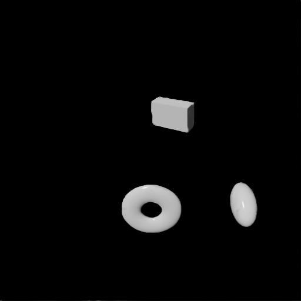
  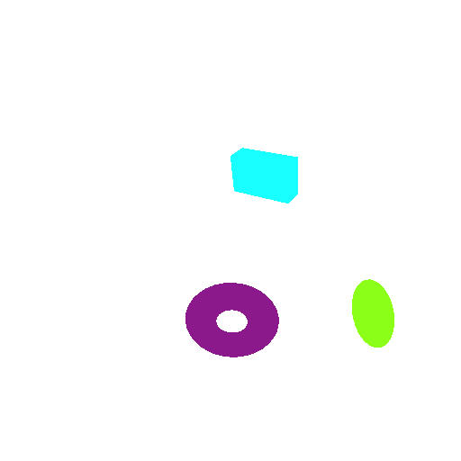
  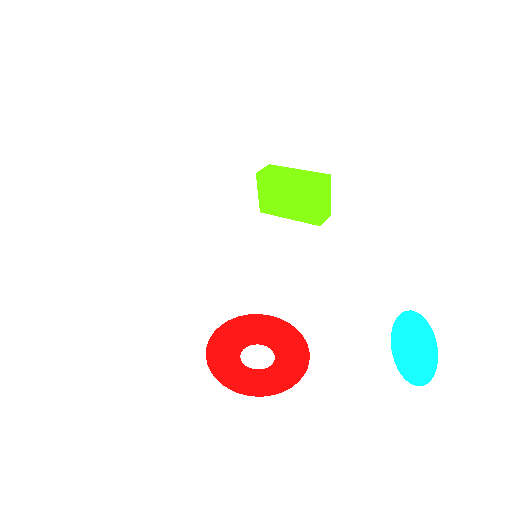
</div>
<div align="center">
  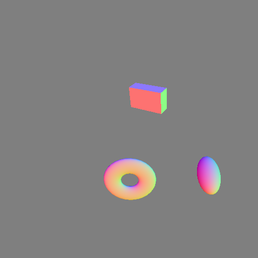
  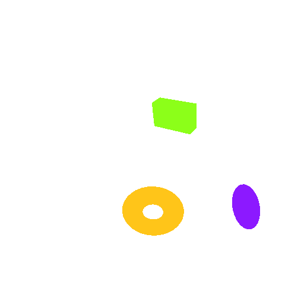
  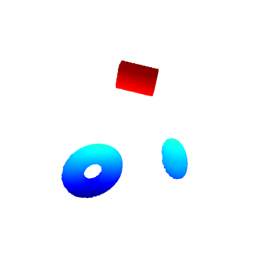
</div>

The output directory will contain:
- RGB (`.png`) 
- Bounding Box 2D (`.npy`)  
- Bounding Box 2D Labels (`.json`) 
- Bounding Box 3D (`.npy`)  
- Bounding Box 3D Labels (`.json`) 
- Bounding Box 3D Prim Paths (`.json`)
- Instance ID Segmentation (`.png`)
- Instance ID Segmentation Mapping (`.json`)
- Instance Segmentation (`.png`)
- Instance Segmentation Mapping (`.json`)
- Instance Segmentation Semantic Mapping (`.json`)
- Normals (`.png`)
- Motion Vectors (`.npy`)
- Occlusions (`.npy`)
- Point Cloud (`.npy`)
- Point Cloud Instance (`.npy`)
- Point Cloud Normals (`.npy`)
- Point Cloud RGB (`.npy`)
- Point Cloud Semantic (`.npy`)
- Semantic Segmenation (`.png`)
- Semantic Segmentation Labels (`.json`)
- Distance to Image Plane (`.npy`)
- Distance to Camera (`.npy`)
- Camera Params (`.json`)

If you want to visualize the pointcloud data with `.npy` format, use this script for `xyz` point visualization only:
```
cd scripts
python3 visualize_pointcloud_xyz.py
```
Use this script for `xyzrgba` point visualization only:
```
cd scripts
python3 visualize_pointcloud_xyzrgba.py
```

<div align="center">
  
  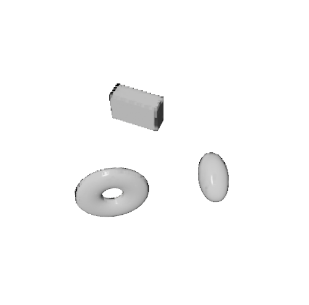
</div>

## Ex 1: Data Capture: BasicWriter
This example demonstrates how to use the `BasicWriter` for data capture with RGB and bounding box annotators. It sets up a scene with a cube and a dome light, attaches semantic labels to the cube, and saves captured data to disk. 

### Standalone: Synchronous Usage
```bash
./python.sh standalone_examples/api/isaacsim.replicator.examples/sdg_getting_started_01.py
```
### Script Editor: Asynchronous Usage 
```bash
import asyncio
import os

import omni.replicator.core as rep
import omni.usd
from isaacsim.core.utils.semantics import add_update_semantics
from pxr import Sdf


async def run_example_async():
    # Create a new stage and disable capture on play
    omni.usd.get_context().new_stage()
    rep.orchestrator.set_capture_on_play(False)

    # Setup the stage with a dome light and a cube
    stage = omni.usd.get_context().get_stage()
    dome_light = stage.DefinePrim("/World/DomeLight", "DomeLight")
    dome_light.CreateAttribute("inputs:intensity", Sdf.ValueTypeNames.Float).Set(500.0)
    cube = stage.DefinePrim("/World/Cube", "Cube")
    add_update_semantics(cube, "MyCube")

    # Create a render product using the viewport perspective camera
    rp = rep.create.render_product("/OmniverseKit_Persp", (512, 512))

    # Write data using the basic writer with the rgb and bounding box annotators
    writer = rep.writers.get("BasicWriter")
    out_dir = os.getcwd() + "/_out_basic_writer"
    print(f"Output directory: {out_dir}")
    writer.initialize(output_dir=out_dir, rgb=True, bounding_box_2d_tight=True)
    writer.attach(rp)

    # Trigger a data capture request (data will be written to disk by the writer)
    for i in range(3):
        print(f"Step {i}")
        await rep.orchestrator.step_async()

    # Destroy the render product to release resources by detaching it from the writer first
    writer.detach()
    rp.destroy()

    # Wait for the data to be written to disk
    await rep.orchestrator.wait_until_complete_async()


# Run the example
asyncio.ensure_future(run_example_async())
```
<div align="center">
  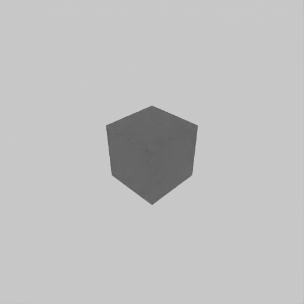
  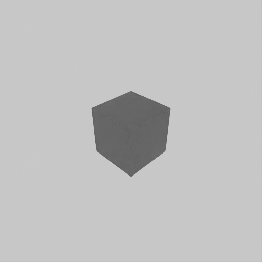
  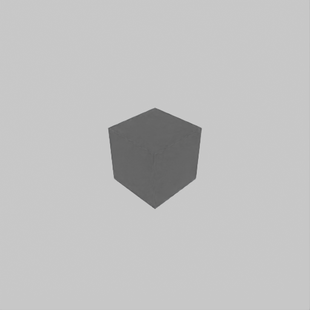
</div>

The output directory `~/isaacsim/_out_basic_writer` will contain:

- RGB (`.png`) 
- 2D Bounding Box Labels (`.npy`) 
- 2D Bounding Box Labels (`.json`)


## Ex 2: Custom Writer and Annotators with Multiple Cameras

This example demonstrates data capture:
 
- Creates a custom writer to access annotator data: 
  - camera parameters 
  - 3D bounding boxes
- It configures:
  - two cameras (custom and viewport perspective), 
  - uses annotators to access data directly
  - writes data to disk using PoseWriter. 

### Standalone: Synchronous Usage 

```bash
./python.sh standalone_examples/api/isaacsim.replicator.examples/sdg_getting_started_02.py
```
### Script Editor: Asynchronous Usage 
```bash
import asyncio
import os

import omni.replicator.core as rep
import omni.usd
from isaacsim.core.utils.semantics import add_update_semantics
from omni.replicator.core import Writer
from pxr import Sdf, UsdGeom


# Create a custom writer to access the annotator data
class MyWriter(Writer):
    def __init__(self, camera_params: bool = True, bounding_box_3d: bool = True):
        # Organize data from render product perspective (legacy, annotator, renderProduct)
        self.data_structure = "renderProduct"
        if camera_params:
            self.annotators.append(rep.annotators.get("camera_params"))
        if bounding_box_3d:
            self.annotators.append(rep.annotators.get("bounding_box_3d"))
        self._frame_id = 0

    def write(self, data):
        print(f"[MyWriter][{self._frame_id}] data:{data}")
        self._frame_id += 1


# Register the writer for use
rep.writers.register_writer(MyWriter)


async def run_example_async():
    # Create a new stage and disable capture on play
    omni.usd.get_context().new_stage()
    rep.orchestrator.set_capture_on_play(False)

    # Setup stage
    stage = omni.usd.get_context().get_stage()
    dome_light = stage.DefinePrim("/World/DomeLight", "DomeLight")
    dome_light.CreateAttribute("inputs:intensity", Sdf.ValueTypeNames.Float).Set(500.0)
    cube = stage.DefinePrim("/World/Cube", "Cube")
    add_update_semantics(cube, "MyCube")

    # Capture from two perspectives, a custom camera and the viewport perspective camera
    camera = stage.DefinePrim("/World/Camera", "Camera")
    UsdGeom.Xformable(camera).AddTranslateOp().Set((0, 0, 20))

    # Create the render products
    rp_cam = rep.create.render_product(camera.GetPath(), (400, 400), name="camera_view")
    rp_persp = rep.create.render_product("/OmniverseKit_Persp", (512, 512), name="perspective_view")

    # Use the annotators to access the data directly, each annotator is attached to a render product
    rgb_annotator_cam = rep.annotators.get("rgb")
    rgb_annotator_cam.attach(rp_cam)
    rgb_annotator_persp = rep.annotators.get("rgb")
    rgb_annotator_persp.attach(rp_persp)

    # Use the custom writer to access the annotator data
    custom_writer = rep.writers.get("MyWriter")
    custom_writer.initialize(camera_params=True, bounding_box_3d=True)
    custom_writer.attach([rp_cam, rp_persp])

    # Use the pose writer to write the data to disk
    pose_writer = rep.WriterRegistry.get("PoseWriter")
    out_dir = os.getcwd() + "/_out_pose_writer"
    print(f"Output directory: {out_dir}")
    pose_writer.initialize(output_dir=out_dir, write_debug_images=True)
    pose_writer.attach([rp_cam, rp_persp])

    # Trigger a data capture request (data will be written to disk by the writer)
    for i in range(3):
        print(f"Step {i}")
        await rep.orchestrator.step_async()

        # Get the data from the annotators
        rgb_data_cam = rgb_annotator_cam.get_data()
        rgb_data_persp = rgb_annotator_persp.get_data()
        print(f"[Annotator][Cam][{i}] rgb_data_cam shape: {rgb_data_cam.shape}")
        print(f"[Annotator][Persp][{i}] rgb_data_persp shape: {rgb_data_persp.shape}")

    # Detach the render products from the annotators and writers and clear them to release resources
    pose_writer.detach()
    custom_writer.detach()
    rgb_annotator_cam.detach()
    rgb_annotator_persp.detach()
    rp_cam.destroy()
    rp_persp.destroy()

    # Wait for the data to be written to disk
    await rep.orchestrator.wait_until_complete_async()


asyncio.ensure_future(run_example_async())
```

<div align="center">
  
  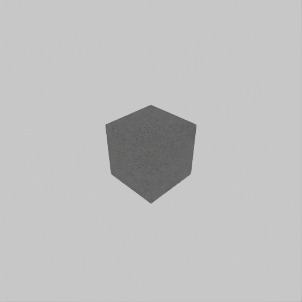
  
</div>
<div align="center">
  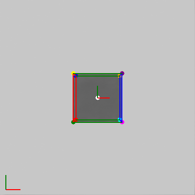
  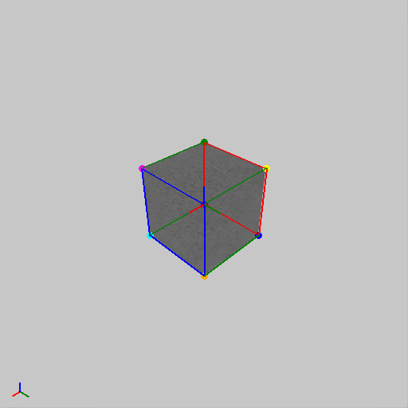
  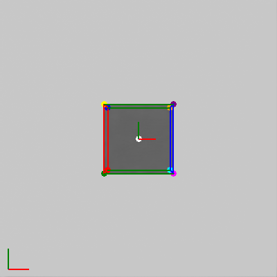
</div>

The output directory `~/isaacsim/_out_pose_writer` will contain: 

- RGB as (`.png`) 
- 3D bounding box annotations (`.png`)
- 3D bounding box annotations (`.json`)   


The 3D bounding box annotations are drawn as overlays. The annotator and custom writer data is printed to the terminal.

## Ex 3: Custom Randomizations: Replicator Graph and USD API
This example demonstrates creating a custom randomization using Replicator’s graph-based randomizers triggered by custom events and a custom USD API-based randomization. A dome light’s color is randomized through custom events, while a cube’s location is randomized via USD API. Data is captured using the BasicWriter with semantic segmentation. 

### Standalone: Synchronous Usage 
```bash
./python.sh standalone_examples/api/isaacsim.replicator.examples/sdg_getting_started_03.py
```
### Script Editor: Asynchronous Usage 
```bash
import asyncio
import os
import random

import omni.kit.app
import omni.replicator.core as rep
import omni.usd
from isaacsim.core.utils.semantics import add_update_semantics
from pxr import UsdGeom


# Custom randomizer function using USD API
def randomize_location(prim):
    if not prim.GetAttribute("xformOp:translate"):
        UsdGeom.Xformable(prim).AddTranslateOp()
    translate = prim.GetAttribute("xformOp:translate")
    translate.Set((random.uniform(-2, 2), random.uniform(-2, 2), random.uniform(-2, 2)))


async def run_example_async():
    # Create a new stage and disable capture on play
    omni.usd.get_context().new_stage()
    rep.orchestrator.set_capture_on_play(False)
    random.seed(42)
    rep.set_global_seed(42)

    # Setup stage
    stage = omni.usd.get_context().get_stage()
    cube = stage.DefinePrim("/World/Cube", "Cube")
    add_update_semantics(cube, "MyCube")

    # Create a replicator randomizer with custom event trigger
    with rep.trigger.on_custom_event(event_name="randomize_dome_light_color"):
        rep.create.light(light_type="Dome", color=rep.distribution.uniform((0, 0, 0), (1, 1, 1)))

    # Create a render product using the viewport perspective camera
    rp = rep.create.render_product("/OmniverseKit_Persp", (512, 512))

    # Write data using the basic writer with the rgb and bounding box annotators
    writer = rep.writers.get("BasicWriter")
    out_dir = os.getcwd() + "/_out_basic_writer_rand"
    print(f"Output directory: {out_dir}")
    writer.initialize(output_dir=out_dir, rgb=True, semantic_segmentation=True, colorize_semantic_segmentation=True)
    writer.attach(rp)

    # Trigger a data capture request (data will be written to disk by the writer)
    for i in range(3):
        print(f"Step {i}")
        # Trigger the custom event randomizer every other step
        if i % 2 == 1:
            rep.utils.send_og_event(event_name="randomize_dome_light_color")

        # Run the custom USD API location randomizer on the prims
        randomize_location(cube)

        # Since the replicator randomizer is set to trigger on custom events, step will only trigger the writer
        await rep.orchestrator.step_async()

    # Destroy the render product to release resources by detaching it from the writer first
    writer.detach()
    rp.destroy()

    # Wait for the data to be written to disk
    await rep.orchestrator.wait_until_complete_async()


# Run the example
asyncio.ensure_future(run_example_async())
```
<div align="center">
  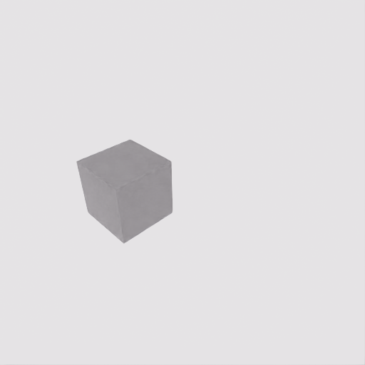
  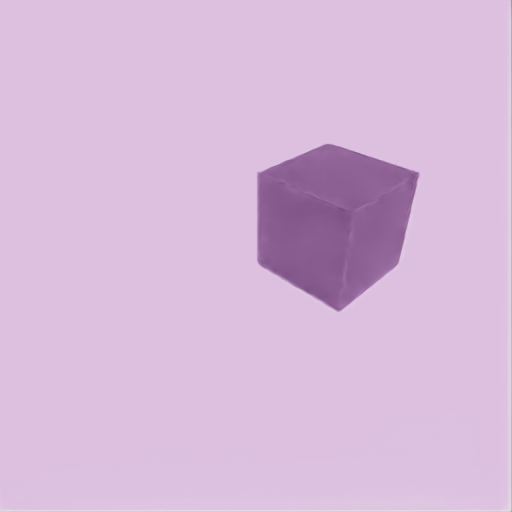
  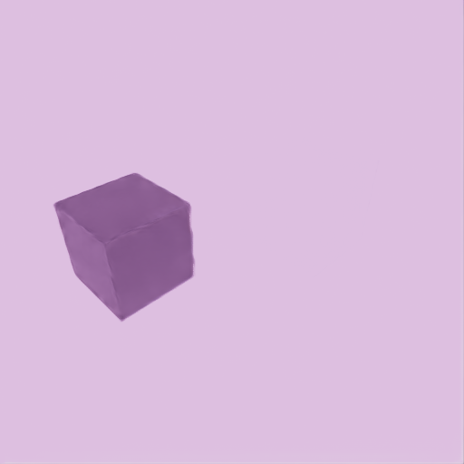
</div>
<div align="center">
  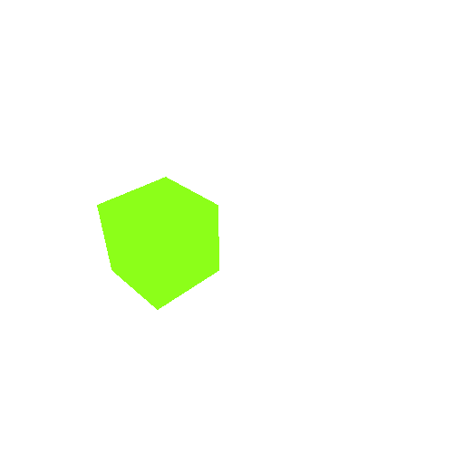
  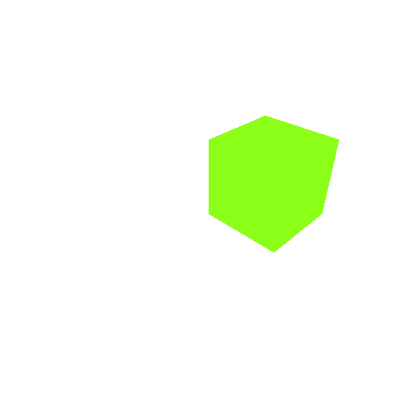
  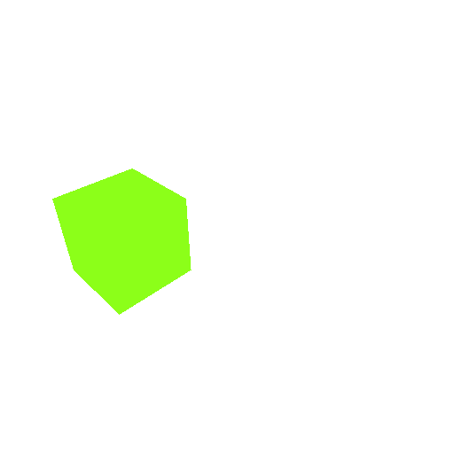
</div>

The output directory `~/isaacsim/_out_basic_writer_rand` will contain: 

- RGB (`.png`) 
- Semantic Segmentation Labels (`.json`)
- Semantic Segmentation (`.png`) 

Note that the cube is randomized each capture, while the dome light color is randomized every second capture.

## Ex 4: Event-Triggered Data Capture: Timeline and Simulation

This example shows how to capture simulation data when specific conditions are met: 
- A cube and sphere are dropped in a physics simulation, and data is captured at specific intervals based on the cube’s height. 
- The timeline is paused during capture to ensure data consistency. 

### Standalone: Synchronous Usage 

```bash
./python.sh standalone_examples/api/isaacsim.replicator.examples/sdg_getting_started_04.py
```
### Script Editor: Asynchronous Usage 
```bash
import asyncio
import os

import omni.kit.app
import omni.replicator.core as rep
import omni.timeline
import omni.usd
from isaacsim.core.utils.semantics import add_update_semantics
from pxr import Sdf, UsdGeom, UsdPhysics


def add_colliders_and_rigid_body_dynamics(prim):
    # Add colliders
    if not prim.HasAPI(UsdPhysics.CollisionAPI):
        collision_api = UsdPhysics.CollisionAPI.Apply(prim)
    else:
        collision_api = UsdPhysics.CollisionAPI(prim)
    collision_api.CreateCollisionEnabledAttr(True)
    # Add rigid body dynamics
    if not prim.HasAPI(UsdPhysics.RigidBodyAPI):
        rigid_body_api = UsdPhysics.RigidBodyAPI.Apply(prim)
    else:
        rigid_body_api = UsdPhysics.RigidBodyAPI(prim)
    rigid_body_api.CreateRigidBodyEnabledAttr(True)


async def run_example_async():
    # Create a new stage and disable capture on play
    omni.usd.get_context().new_stage()
    rep.orchestrator.set_capture_on_play(False)

    # Add a light
    stage = omni.usd.get_context().get_stage()
    dome_light = stage.DefinePrim("/World/DomeLight", "DomeLight")
    dome_light.CreateAttribute("inputs:intensity", Sdf.ValueTypeNames.Float).Set(500.0)

    # Create a cube with colliders and rigid body dynamics at a specific location
    cube = stage.DefinePrim("/World/Cube", "Cube")
    add_colliders_and_rigid_body_dynamics(cube)
    if not cube.GetAttribute("xformOp:translate"):
        UsdGeom.Xformable(cube).AddTranslateOp()
    cube.GetAttribute("xformOp:translate").Set((0, 0, 2))
    add_update_semantics(cube, "MyCube")

    # Createa a sphere with colliders and rigid body dynamics next to the cube
    sphere = stage.DefinePrim("/World/Sphere", "Sphere")
    add_colliders_and_rigid_body_dynamics(sphere)
    if not sphere.GetAttribute("xformOp:translate"):
        UsdGeom.Xformable(sphere).AddTranslateOp()
    sphere.GetAttribute("xformOp:translate").Set((-1, -1, 2))
    add_update_semantics(sphere, "MySphere")

    # Create a render product using the viewport perspective camera
    rp = rep.create.render_product("/OmniverseKit_Persp", (512, 512))

    # Write data using the basic writer with the rgb and bounding box annotators
    writer = rep.writers.get("BasicWriter")
    out_dir = os.getcwd() + "/_out_basic_writer_sim"
    print(f"Output directory: {out_dir}")
    writer.initialize(output_dir=out_dir, rgb=True, semantic_segmentation=True, colorize_semantic_segmentation=True)
    writer.attach(rp)

    # Start the timeline (will only advance with app update)
    timeline = omni.timeline.get_timeline_interface()
    timeline.play()

    # Update the app and implicitly advance the simulation
    drop_delta = 0.5
    last_capture_height = cube.GetAttribute("xformOp:translate").Get()[2]
    for i in range(100):
        # Get the current height of the cube and the distance it dropped since the last capture
        await omni.kit.app.get_app().next_update_async()
        current_height = cube.GetAttribute("xformOp:translate").Get()[2]
        drop_since_last_capture = last_capture_height - current_height
        print(f"Step {i}; cube height: {current_height:.3f}; drop since last capture: {drop_since_last_capture:.3f}")

        # Stop the simulation if the cube falls below the ground
        if current_height < 0:
            print(f"\t Cube fell below the ground at height {current_height:.3f}, stopping simulation..")
            timeline.pause()
            break

        # Capture every time the cube drops by the threshold distance
        if drop_since_last_capture >= drop_delta:
            print(f"\t Capturing at height {current_height:.3f}")
            last_capture_height = current_height
            # Pause the timeline to capture multiple frames of the same simulation state
            timeline.pause()

            # Setting delta_time to 0.0 will make sure the step function will not advance the simulation during capture
            await rep.orchestrator.step_async(delta_time=0.0)

            # Capture again with the cube hidden
            UsdGeom.Imageable(cube).MakeInvisible()
            await rep.orchestrator.step_async(delta_time=0.0)
            UsdGeom.Imageable(cube).MakeVisible()

            # Resume the timeline to continue the simulation
            timeline.play()

    # Destroy the render product to release resources by detaching it from the writer first
    writer.detach()
    rp.destroy()

    # Wait for the data to be written to disk
    await rep.orchestrator.wait_until_complete_async()


# Run the example
asyncio.ensure_future(run_example_async())
```

This will generate data like this:
<div align="center">
  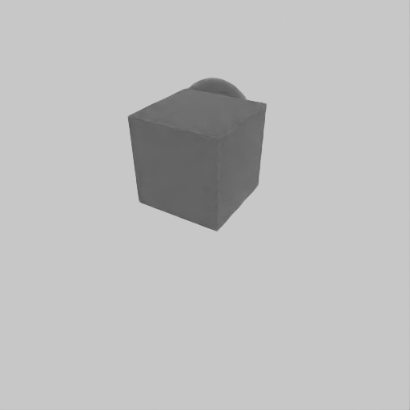
  
  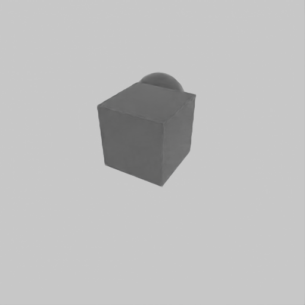
</div>
<div align="center">
  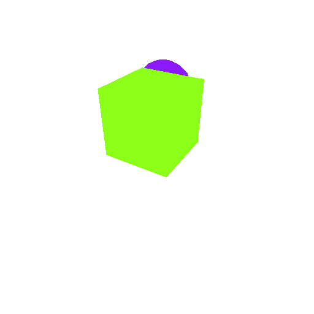
  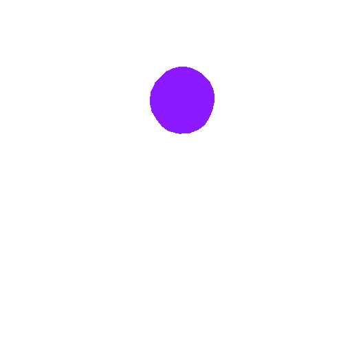
  
</div>

The output directory `~/isaacsim/_out_basic_writer_sim` will contain: 
- RGB (`.png`)
- Semantic Segmentation labels (`.json`)
- Semantic Segmentation (`.png`) 

Semantic Segmentation has been captured with the captured data at specific simulation times (cube drop height intervals) and the cube hidden during capture. During every second capture with the cube hidden, the timeline will not advance (`delta_time=0.0`) ensuring the same simulation state can be captured multiple times.


- Basics and Getting Started
  - [Overview](https://docs.isaacsim.omniverse.nvidia.com/latest/replicator_tutorials/tutorial_replicator_overview.html)
  - [Synthetic Data Recorder](https://docs.isaacsim.omniverse.nvidia.com/latest/replicator_tutorials/tutorial_replicator_recorder.html)
  - [Getting Started Scripts](https://docs.isaacsim.omniverse.nvidia.com/latest/replicator_tutorials/tutorial_replicator_getting_started.html)

- SDG Tutorials
  - [Scene Based Synthetic Dataset Generation](https://docs.isaacsim.omniverse.nvidia.com/latest/replicator_tutorials/tutorial_replicator_scene_based_sdg.html)
  - [Object Based Synthetic Dataset Generation](https://docs.isaacsim.omniverse.nvidia.com/latest/replicator_tutorials/tutorial_replicator_object_based_sdg.html)
  - [Environment Based Synthetic Dataset Generation with Infinigen](https://docs.isaacsim.omniverse.nvidia.com/latest/replicator_tutorials/tutorial_replicator_infinigen_sdg.html)
  - [Online Generation](https://docs.isaacsim.omniverse.nvidia.com/latest/replicator_tutorials/tutorial_replicator_online_generation.html)
  - [Pose Estimation Synthetic Data Generation](https://docs.isaacsim.omniverse.nvidia.com/latest/replicator_tutorials/tutorial_replicator_pose_estimation.html)
  - [Training Pose Estimation Model with Synthetic Data](https://docs.isaacsim.omniverse.nvidia.com/latest/replicator_tutorials/tutorial_replicator_training_pose_estimation_model.html)
  - [Randomization in Simulation – AMR Navigation](https://docs.isaacsim.omniverse.nvidia.com/latest/replicator_tutorials/tutorial_replicator_amr_navigation.html)
  - [Randomization in Simulation – UR10 Palletizing](https://docs.isaacsim.omniverse.nvidia.com/latest/replicator_tutorials/tutorial_replicator_ur10_palletizing.html)
  - [Custom Replicator Randomization Nodes](https://docs.isaacsim.omniverse.nvidia.com/latest/replicator_tutorials/tutorial_replicator_custom_og_randomizer.html)

- Snippets and Features
  - [Useful Snippets](https://docs.isaacsim.omniverse.nvidia.com/latest/replicator_tutorials/tutorial_replicator_isaac_snippets.html)
  - [Randomization Snippets](https://docs.isaacsim.omniverse.nvidia.com/latest/replicator_tutorials/tutorial_replicator_isaac_randomizers.html)
  - [Data Augmentation](https://docs.isaacsim.omniverse.nvidia.com/latest/replicator_tutorials/tutorial_replicator_augmentation.html)
  - [Modular Behavior Scripting](https://docs.isaacsim.omniverse.nvidia.com/latest/replicator_tutorials/tutorial_replicator_modular_scripting.html)

## Resources
- Omniverse Replicator Tutorial: Setup Guide for Synthetic Data Generation [[video]](https://www.youtube.com/watch?v=_a55hAAF27I)
- Isaac Sim Installation & Core Functions | "Hello World" of Omniverse Replicator [[video]](https://www.youtube.com/watch?v=_kzW6yBno6Q)
- Isaac Sim: Replicator - People and Robots [[video]](https://www.youtube.com/watch?v=F3jxzIKAf9M)
- Isaac Sim: Omniverse Replicator - Synthetic Data Generation (Warehouse with palletjacks) [[video]](https://www.youtube.com/watch?v=hk8nQT9Q0CM)
- NVIDIA Omniverse Replicator - Synthetic Data Generation [[video]](https://www.youtube.com/watch?v=oPYjV8R4pCE) 
